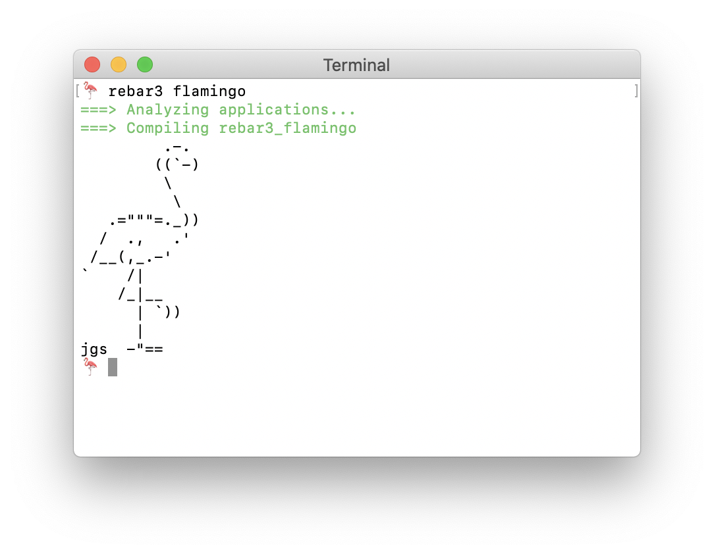

rebar3_flamingo
=====

A rebar plugin that prints flamingos 🦩

Usage
-----

    $ rebar3 compile

Use
---

1. Check rebar3_flamingo out in a `_checkouts` directory in your project root.
2. Add `{project_plugins, [rebar3_flamingo]}.` to your `rebar.config`
3. `$ rebar3 flamingo`

